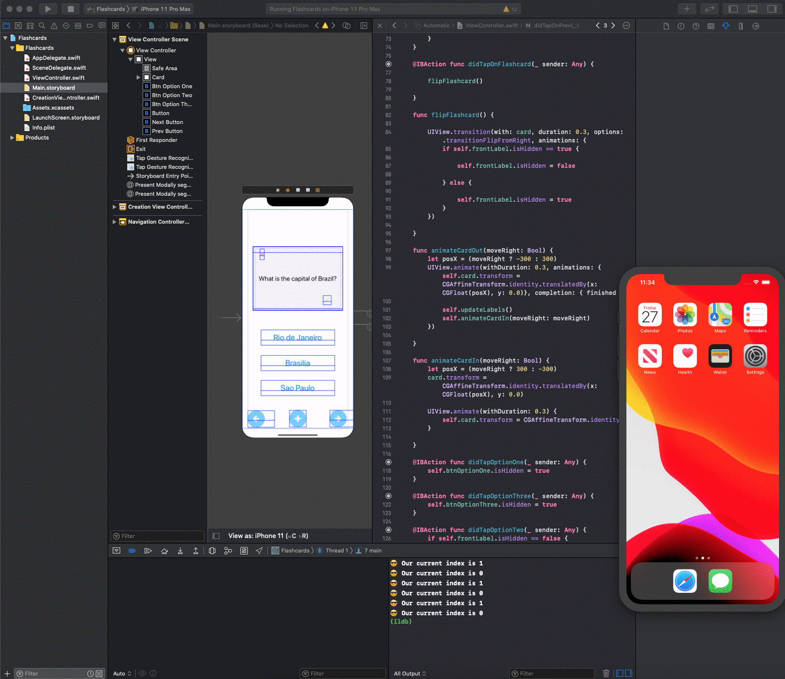

## Lab 4

### App Description
This Updated flashcard user can see app icon and app logo on the splash screen. Also, when revealing the answer and question it has flipping animation. It has slide animation for when going next flashcard or goes back.

### App Walk-though

 

## Required
- [x] User should see the app icon 
- [x] User should see a splash screen
- [x] User should see an flip animation when revealing the answer
- [x] User should see a slide animation when going to the next flashcard
- [x] User should see a slide animation when going to the previous flashcard
- [x] Push code to GitHub
## Optional
- [ ] User should see a nicer flaschard with rounded corners, shadows, and animating when showing the first time
- [ ] User should see all views properly layout when using the app on a phone of different sizes
- [ ] Correct answer in multiple choice should be random

## Lab 3

### App Description

This lab 3, my flashcard app browse through multiple flash cards also edit current flashcard with 3 multi-choice option and create new flashcard as well. User can re-open flashcard app with all saved answer and questions. User also can delete flashcard.

### App Walk-though

 

## Required
- [x] User can browse through multiple flashcards
- [x] User can re-open the app and see previously created flashcards
- [x] Push code to GitHub
## Optional
- [x] User can delete a flashcard
- [x] User can edit existing flashcard
- [x] User can store multiple choice questions

## Lab 2

### App Description
Flashcard app lab 2
i did required section and first optional task.

### App Walk-though

 

Additional on lab 1 this updated flashcard app has new button which is lead to another screen. In new screen user can input their customized question and answer for updating main question and answer after that user can close page. If user didn't put any text on question and answer field app will give generic error or user can cancel creation screen. Original screen have edit button but right now it's not fully functional yet, I will update it pretty soon. 

## Required
- [ ] User can open the creation screen
- [ ] User can cancel out of the creation screen
- [ ] User can enter a new question and answer in the creation screen to then show it on the flashcard
- [ ] Push code to GitHub
## Optional
- [ ] User gets an error if they try to create a new flashcard with no question or answer
- [ ] User can edit existing flashcard
- [ ] User can add multiple choice answers in the creation screen

## Lab 1

### App Description
`TODO://` Add app description

This simple flashcard app is ask question and gives selectable 3 multi-choice option to answer.
After that it can reset everything if you click on the screen. 

### App Walk-though

 

## Required
- [ ] Create New Project in Xcode
- [ ] Add a view for the front side of the flashcard to display the question
- [ ] Add a view for the back side of the flashcard to display the answer
- [ ] Build in logic to show the answer side when the card is tapped
- [ ] Push code to GitHub
## Optional
- [ ] Toggle the flashcard between the question side and the answer side
- [ ] Style the question and answer side of the card to better distinguish between the two sides
- [ ] Add selectable multiple choice answers beneath the card
